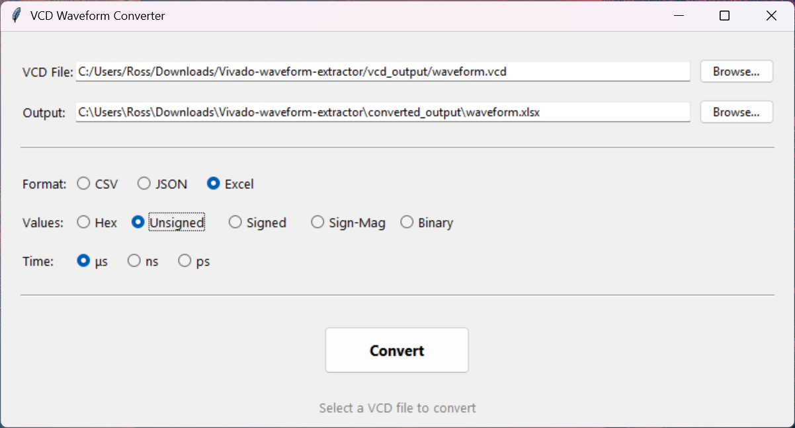
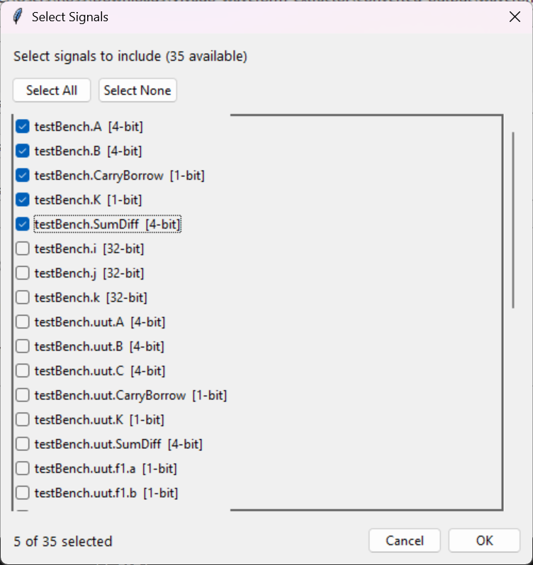

# Vivado Waveform Extractor

Extract simulation waveform data from Xilinx Vivado XSim to VCD, CSV, JSON, or Excel formats.

## Quick Start

### 1. Generate VCD from Vivado

In Vivado: `Tools` → `Run Tcl Script` → select `extract_waveform.tcl` (while simulation window is open)

**Auto-logging (recommended):** Just use normal `run` commands - VCD captures automatically!
```tcl
run 100us              # Auto-logs to waveform.vcd
run -all               # Works with testbenches too
```

**Manual capture:** For more control (restarts simulation, applies forces)
```tcl
capture "all"          # For testbench (runs until $finish)
capture "100us"        # For manual testing
```

The VCD file is saved to `vcd_output/` next to the script.

### 2. Convert VCD to Other Formats (Optional)

```bash
python vcd_converter.py                      # GUI
python vcd_converter.py waveform.vcd --json  # CLI
```
## Converter GUI



## Signal Selection



Click **"Select Signals..."** to choose which signals to include in the export. This is useful for excluding internal/temporary signals from sub-modules. The dialog shows full hierarchical paths (e.g., `testBench.uut.f1.carry`) so you can easily identify signals from different module instances.

## Requirements

**Tcl Script:** Xilinx Vivado 2020.x+ with active XSim simulation

**Python Converter:** Python 3.6+ (tkinter included). Excel export auto-installs `openpyxl` on first use.

## Project Structure

```
├── extract_waveform.tcl    # Tcl script for Vivado XSim
├── vcd_converter.py        # Python converter (CLI + GUI)
├── vcd_converter.pyw       # GUI only (double-click, no console window)
├── vcd_output/             # VCD files (auto-created)
└── converted_output/       # CSV/JSON/Excel (auto-created)
```

---

## Command Reference

### Tcl Commands (Vivado)

| Command | Description |
|---------|-------------|
| `capture "<time>"` | Restart, apply forces, run for `<time>` duration save VCD |
| `capture "all"` | Run until testbench `$finish` |
| `autolog on/off` | Enable/disable auto-logging |
| `stop_auto_log` | Save and close current VCD |
| `force /path hex FF` | Force signal (remembered across restarts) |
| `show_forces` | List recorded forces |
| `clear_forces` | Clear all forces |
| `signals` | List all signals |
| `snapshot` | Export current values to CSV |

### Python CLI

```
python vcd_converter.py <input.vcd> [-o output] [--csv|--json|--excel] [--hex|--int|--signed|--smag|--bin] [--us|--ns|--ps] [--signals] [--include <pattern>] [--exclude <pattern>]
```

| Option | Description |
|--------|-------------|
| `-o <file>` | Output path |
| `--csv/--json/--excel` | Output format (default: csv) |
| `--hex` | Values as hexadecimal (default) |
| `--int` | Values as unsigned integers |
| `--signed` | Values as signed two's complement |
| `--smag` | Values as signed magnitude |
| `--bin` | Values as binary strings |
| `--us/--ns/--ps` | Time unit (default: us) |
| `--signals` | List available signals and exit |
| `--include <pattern>` | Include only signals matching pattern (glob-style, repeatable) |
| `--exclude <pattern>` | Exclude signals matching pattern (glob-style, repeatable) |

**Signal Filtering Examples:**
```bash
# List all signals in a VCD file
python vcd_converter.py waveform.vcd --signals

# Export only top-level testbench signals (exclude sub-modules)
python vcd_converter.py waveform.vcd --include "testBench.*" --exclude "testBench.uut.*"

# Exclude internal full-adder signals
python vcd_converter.py waveform.vcd --exclude "*.f1.*" --exclude "*.f2.*" --exclude "*.f3.*" --exclude "*.f4.*"

# Include only specific signals
python vcd_converter.py waveform.vcd --include "*SumDiff*" --include "*Carry*"
```

> **Excel Graphing Tip:** Use `--int`, `--signed`, or `--smag` for Excel export if you want to create graphs. These formats store actual numbers. Hex and binary are stored as text (to preserve formatting like leading zeros) and cannot be graphed directly.

---

## Theory & Implementation

### Why VCD?

Vivado XSim supports **VCD (Value Change Dump)**, an IEEE standard (IEEE 1364) for waveform data. VCD is event-driven: it only records timestamps when signals *change*, making it compact.

### How the Tcl Script Works

The script uses three XSim commands:
- `open_vcd <file>` - Opens VCD file for writing
- `log_vcd *` - Registers all signals for logging (must be called *before* running)
- `close_vcd` - Finalizes the file

**Auto-logging** overrides the built-in `run` command. When you type `run 100us`, it automatically opens a VCD file, logs all signals, runs the simulation, then saves when you call `stop_auto_log` or `restart`. The `capture` command provides more control: it restarts simulation, reapplies any saved forces, then captures to a clean file.

### VCD Format

```
$timescale 1ps $end           ← Timestamps in picoseconds
$var wire 8 " data [7:0] $end ← Signal declaration (ID=", 8-bit)
#0                            ← Time = 0
b00000000 "                   ← data = 0
#5000                         ← Time = 5ns
b00000001 "                   ← data = 1
```

### Python Converter

The converter parses VCD in two passes:
1. **Header** - Extract signal declarations with full hierarchical paths (e.g., `testBench.uut.f1.carry`)
2. **Values** - Track changes over time, build complete timeline

**Hierarchical Signal Names:** Signals are stored with their full module path, making it easy to identify signals from different instances. For example, if your design has multiple full-adders, you'll see `testBench.uut.f1.a`, `testBench.uut.f2.a`, etc. instead of just `a` repeated.

**Signal Aliasing:** VCD files share IDs for electrically connected signals. The converter handles this correctly, showing all signal names even when they share the same underlying net (e.g., `testBench.CarryBorrow` and `testBench.uut.f4.carry` may be the same signal).

Since VCD only records *changes*, the converter maintains current state and outputs complete snapshots at each timestamp. Values containing `x` (unknown) or `z` (high-impedance) are preserved as-is in the output.

**Signal Filtering:** Use `--include` / `--exclude` patterns (CLI) or the "Select Signals" button (GUI) to export only the signals you need, excluding internal/temporary signals.

---

## Troubleshooting

- **No signals in VCD:** Run simulation at least once before loading the script.
- **Empty VCD file:** Ensure simulation ran. Check write permissions.
- **Forces not applied:** Use exact signal paths. Run `signals` to see available paths.
